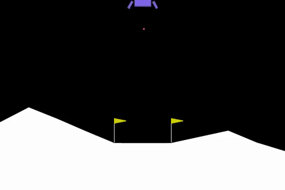
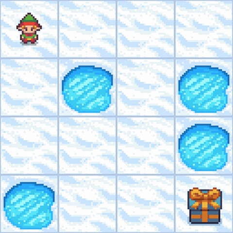
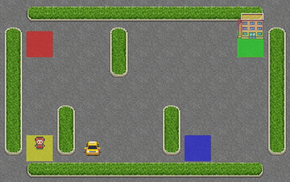
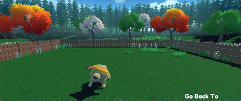
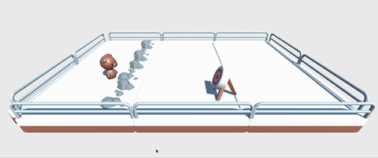
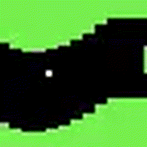
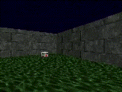

# Hugging Face Deep Reinforcement Learning Course Models

This directory contains trained models from the [Hugging Face Deep Reinforcement Learning Course](https://huggingface.co/deep-rl-course). Each model represents a different environment and algorithm combination, showcasing various aspects of deep reinforcement learning.

## Course Overview

The Hugging Face Deep Reinforcement Learning Course is a comprehensive program that covers:
- Fundamental RL concepts and algorithms
- Implementation of popular RL algorithms (DQN, PPO, A2C, REINFORCE, etc.)
- Training agents in various environments
- Model evaluation and deployment on Hugging Face Hub

## Trained Models

### Classic Control Environments

#### **CartPole-v1** 
- **Algorithm**: REINFORCE
- **Repository**: `siddiskid/Reinforce-CartPole-v1`
- **Description**: Classic cart-pole balancing task using policy gradient methods
- **Environment**: Discrete action space, continuous observation space

#### **LunarLander-v2** 
- **Algorithm**: PPO (Proximal Policy Optimization)
- **Repository**: `siddiskid/ppo-LunarLander-v2`
- **Description**: Spacecraft landing simulation with fuel efficiency optimization
- **Environment**: Discrete actions, 8-dimensional continuous observation space



### Grid World Environments

#### **FrozenLake-v1** 
- **Algorithm**: Q-Learning
- **Repository**: `siddiskid/q-FrozenLake-v1-4x4-noSlippery`
- **Description**: Navigate a frozen lake to reach the goal while avoiding holes
- **Environment**: 4x4 grid, discrete state and action spaces



#### **Taxi-v3** 
- **Algorithm**: Q-Learning
- **Repository**: `siddiskid/taxt`
- **Description**: Taxi pickup and dropoff task in a grid world
- **Environment**: Discrete state and action spaces



### Atari Games

#### **SpaceInvaders-NoFrameskip-v4** 
- **Algorithm**: DQN (Deep Q-Network)
- **Repository**: `siddiskid/dqn-SpaceInvadersNoFrameskip-v4`
- **Description**: Classic space invaders arcade game
- **Environment**: High-dimensional visual input, discrete actions

### Unity ML-Agents Environments

#### **Huggy** 
- **Algorithm**: PPO
- **Repository**: `siddiskid/ppo-Huggy`
- **Description**: Train a dog agent to fetch a stick
- **Environment**: 3D Unity environment with continuous control



#### **SnowballTarget** 
- **Algorithm**: PPO
- **Repository**: `siddiskid/ppo-SnowballTarget`
- **Description**: Aim and throw snowballs at targets
- **Environment**: 3D Unity environment



#### **Pyramids** 
- **Algorithm**: PPO with Curiosity
- **Repository**: `siddiskid/ppo-Pyramids`
- **Description**: Navigate pyramid environments with sparse rewards
- **Environment**: 3D Unity environment with exploration challenges

#### **SoccerTwos** 
- **Algorithm**: POCA (Population-Based Collective Agents)
- **Repository**: `siddiskid/poca-SoccerTwos`
- **Description**: Multi-agent soccer game
- **Environment**: Competitive multi-agent 3D environment

### Robotics Environments

#### **PandaReachDense-v3** 
- **Algorithm**: A2C (Advantage Actor-Critic)
- **Repository**: `siddiskid/a2c-PandaReachDense-v3`
- **Description**: Robotic arm reaching task with dense rewards
- **Environment**: Continuous control, 7-DOF robotic arm simulation

### Custom Game Environments

#### **PixelCopter** 
- **Algorithm**: REINFORCE
- **Repository**: `siddiskid/Reinforce-PixelCopter`
- **Description**: Navigate a helicopter through obstacles
- **Environment**: Side-scrolling game with pixel-based graphics



#### **ViZDoom Health Gathering** 
- **Algorithm**: Deep RL Course Implementation
- **Repository**: `siddiskid/rl_course_vizdoom_health_gathering_supreme`
- **Description**: First-person shooter environment focused on health collection
- **Environment**: 3D FPS with visual observations



## Model Performance

Each model directory contains:
- `README.md` - Detailed model information and training metrics
- `config.json` - Model configuration and hyperparameters
- `results.json` - Training results and performance metrics
- Model files (`.pt`, `.onnx`, `.zip` depending on framework)
- Video replays (`replay.mp4`) converted to GIFs for display

## Usage

To use these models:

1. **Download from Hugging Face Hub**:
   ```python
   from huggingface_hub import snapshot_download
   
   # Download a specific model
   snapshot_download(
       repo_id="siddiskid/ppo-LunarLander-v2",
       local_dir="./LunarLander",
       repo_type="model"
   )
   ```

2. **Load and evaluate**:
   ```python
   # Example for PPO models
   from stable_baselines3 import PPO
   
   model = PPO.load("./LunarLander/ppo-LunarLander-v2.zip")
   ```
